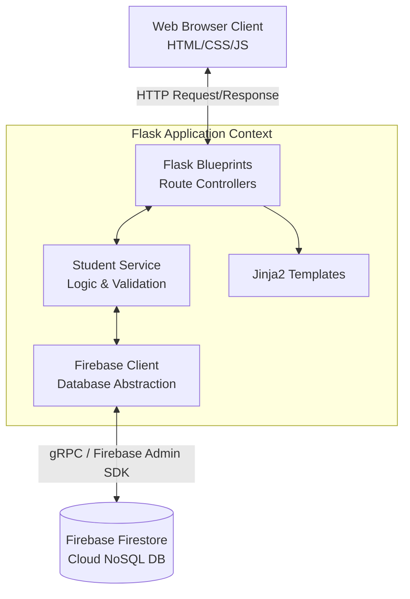

# Student Management System (SNU-ERP V2)
    

A modern, high-performance Student Management System engineered with Python/Flask on the backend and Firebase Firestore for a real-time, NoSQL database layer. The frontend features a sleek glassmorphic design system and responsive UI, delivering a premium "SNU-ERP V2" experience.

---

## 🌟 Key Features

- **Full Data Lifecyle**: Complete CRUD capabilities for student records (Roll No, Name, Department, Year, Marks, Contact).
- **Responsive Analytics Dashboard**: Built using Chart.js to render real-time student distribution, average marks, and top scorers.
- **Real-Time Interactive UI**: Debounced local searching, department/year filtering, and column sorting without page reloading. 
- **Bulk Data Migration**: Supports CSV Export to download reports, and CSV Import with sophisticated row-by-row validation for bulk data entry.
- **Modern "Glassmorphic" Design System**: 
    - Full dark/light mode toggle with immediate storage persistence.
    - Custom micro-animations (e.g., slide-out toasts, dynamic stat-counters, modal pop-ins).
    - Premium custom typography (`Inter` from Google Fonts).
- **Resilient Error Boundaries**: Graceful fallback pages (404, 500) and server-side validation rejecting malformed inputs instantly.

---

## 🏗️ System Architecture

The project strictly follows a **Service-Oriented Architecture (SOA)**, separating the logic into specific layers for modularity and maintainability.



### Architectural Layers
1. **Presentation Layer (Frontend)**: Standard HTML5, CSS3, and Vanilla JavaScript. Flask's Jinja2 template engine is used to dynamically construct the DOM before delivering it to the client. Search and filtering happen entirely client-side using a debounced JS strategy.
2. **Controller Layer (Flask Blueprints)**: Receives HTTP inputs, extracts request data, acts as intermediate communicators (`routes/main_routes.py`, `student_routes.py`, `export_routes.py`).
3. **Business Logic / Service Layer**: Contains rules and constraints. Validates fields, checks for duplicate records, and formats timestamp payload schemas before hitting the DB (`services/student_service.py`).
4. **Data Access Layer (Firebase Wrapper)**: Pure CRUD abstraction that securely interacts with the Google Firebase Cloud using a JSON service account key (`services/firebase_client.py`).

---

## 📂 Project Structure

```text
📦 Python-Project
 ┣ 📂 routes                # Route Controllers (Blueprints)
 ┃ ┣ 📜 export_routes.py    # CSV Import/Export controllers
 ┃ ┣ 📜 main_routes.py      # Core dashboard & main entry controllers
 ┃ ┗ 📜 student_routes.py   # Student CRUD controllers
 ┣ 📂 services              # Business logic & external adapters
 ┃ ┣ 📜 firebase_client.py  # Abstraction layer for Firestore
 ┃ ┗ 📜 student_service.py  # Form validators and data standardizers
 ┣ 📂 static                # Client-Side Assets
 ┃ ┣ 📂 css
 ┃ ┃ ┗ 📜 style.css         # 1000+ line Custom Design System 
 ┃ ┗ 📂 js
 ┃   ┣ 📜 main.js           # Theme toggle, global events, toast animations
 ┃   ┗ 📜 search.js         # Real-time debounce searching & DOM sorting
 ┣ 📂 templates             # Jinja2 HTML Templates
 ┃ ┣ 📂 components          # Partials (navbar, toast, modals)
 ┃ ┣ 📂 errors              # 404 and 500 error boundaries
 ┃ ┣ 📂 students            # List, Add, Edit page structures
 ┃ ┣ 📜 base.html           # Main Boilerplate
 ┃ ┗ 📜 dashboard.html      # Landing Dashboard UI
 ┣ 📜 .env                  # Secrets configuration
 ┣ 📜 app.py                # Flask application factory
 ┣ 📜 config.py             # Config objects loader
 ┣ 📜 firebase-key.json     # 🔒 Secret Firebase Admin SDK service account key
 ┗ 📜 requirements.txt      # Python dependencies
```

---

## 📊 Database Design (Firestore)

Given that Firebase Firestore is a NoSQL schema-less document database, the project standardizes the structure artificially on insertion.

**Collection:** `students`  
**Document ID:** (Auto-generated by Firebase OR Student `roll_number` natively)

| Field | Type | Description |
| :--- | :--- | :--- |
| `roll_number` | `String` | Core Identifier, must be alphanumeric (e.g. `CSE001`). Overlaps with Document ID. |
| `name` | `String` | Full student name. |
| `department` | `String` | Regulated dropdown options (e.g. `CSE`, `ECE`, `ME`). |
| `year` | `Integer` | Academic year context (1-4). |
| `marks` | `Integer` | Out of 100. Determines dashboard top-scorer algorithms. |
| `email` | `String` | Optional contact email. |
| `phone` | `String` | Optional contact 10-15 digit string. |
| `added_on` | `Timestamp`| Auto-populated native Firestore Timestamp. |
| `last_updated` | `Timestamp`| Auto-populated native Firestore Timestamp on edits. |

---

## ⚙️ How the Backend Works

The backend follows a distinct path for processing requests to maintain security, validation, and modularity. Here is the operational flow when a user interacts with the system (for example, adding a new student):

1. **Routing Strategy (Blueprints)**:  
   When a user submits a form to `/students/add`, the request is intercepted by the `student_routes.py` Flask Blueprint controller. The controller extracts the raw data payload from the global `request.form` dictionary.

2. **Validation & Preparation (Service Layer)**:  
   Before hitting the database, the data is passed to `student_service.py`:
   - `validate_student_data()`: Applies business rules (e.g., marks must be between 0-100, roll numbers must be alphanumeric, names cannot be empty).
   - If validation *fails*, it immediately throws errors back to the UI interface, pre-filling the form via Jinja2 so the user doesn't lose their input.
   - If validation *succeeds*, it runs through `prepare_student_for_save()` to standardize the data (e.g., capitalizing names, stripping trailing spaces, ensuring roll numbers are uppercase).

3. **Data Access & Fallbacks (Firebase Wrapper)**:  
   The standardized dictionary is handed to `firebase_client.py`.
   - The wrapper initiates a transaction with Firebase Firestore (`add_student(data)`).
   - It securely communicates via gRPC using the Google Admin SDK credentials loaded via `.env`.
   - **Resiliency Factor**: If a student is queried or edited, Firebase will first attempt a fast *O(1)* lookup using the Document ID. If the Document ID doesn't match the student's `roll_number` (which can happen during bulk CSV imports), the backend features a smart fallback that searches through the `students` collection by matching the actual `roll_number` field value.

4. **Return Response**:  
   Upon success, the Flask controller triggers a `flash()` success message and executes an HTTP 302 redirect back to the student list. On the frontend, Jinja2 evaluates the flashed message and triggers the `showToast()` JavaScript animation to confirm the operation to the user seamlessly.

---

## 🚀 Installation & Setup

1. **Clone the repository** (if from VCS) or navigate into the root directory.

2. **Create a Python Virtual Environment**:
   ```bash
   python -m venv venv
   # On Windows:
   .\venv\Scripts\activate
   # On macOS/Linux:
   source venv/bin/activate
   ```

3. **Install Dependencies**:
   ```bash
   pip install -r requirements.txt
   ```

4. **Add Firebase Credentials**:
   Generate a new Private Key from your Firebase Project Console (`Project Settings -> Service Accounts -> Generate New Private Key`). Save the downloaded JSON file as `firebase-key.json` directly into the project root directory.

5. **Set up Environment Variables**:
   Create a `.env` file in the root directory:
   ```env
   # .env
   FLASK_SECRET_KEY=your_secure_unique_random_string_here
   FIREBASE_CREDENTIALS=firebase-key.json
   ```

6. **Run the Application**:
   ```bash
   python app.py
   ```
   *The local server will start in debug mode on http://127.0.0.1:5000/*

---

## 🔮 Roadmap / Future Capabilities

1. **Deployment Phase**: Configuration is required to support Cloud-native CI/CD deployment logic (like managing `FIREBASE_CREDENTIALS` json injection via encrypted strings on platforms like Render/Heroku).
2. **Access Control Layer**: Integrate Firebase Auth to allow multiple faculty domains with R/W privilege segregation.
3. **Audit Log Activation**: A stretch goal stub exists in `firebase_client.py` for logging document tracking modifications over time into an `audit_log` nested collection.

---
*Built with ❤️ for a modern Academic Experience.*
